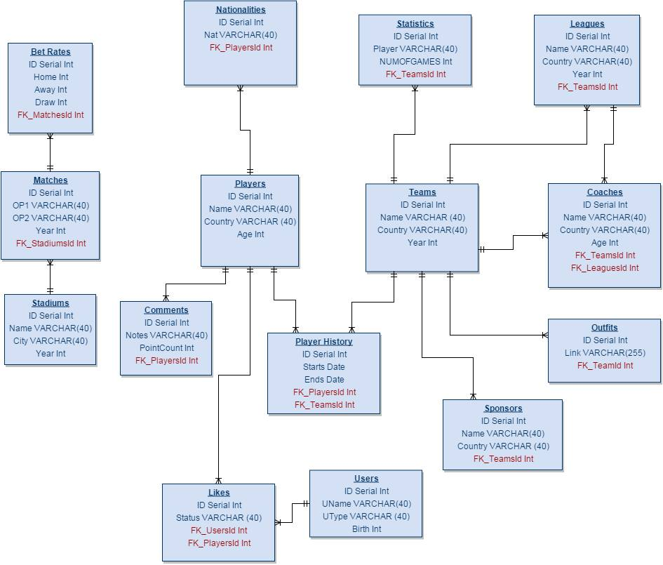

Developer Guide
===============

ER Diagram
----------
ER diagram of all tables is below.

Mutual Pages
------------

server.py
+++++++++

.. code-block:: python
    :linenos:

      @app.route('/')
      def home():
          return HomePage.HomePageFunc()

A function that returns the homepage.

.. code-block:: python
    :linenos:

      @app.route('/initDB/')
      def InitDb():
          return initPage.InitPageFunc(app.config['dsn'])

A function that initializes the database and forms all the tables.

*Sample page functions*

.. code-block:: python
    :linenos:

      @app.route('/sponsorsList', methods=['GET', 'POST'])
      def sponsorsList():
          dsn=app.config['dsn']
          return sponsorslist.sponsorsList(dsn)

A function that calls the main page of a table, that you can do the operations: add, delete, find.

.. code-block:: python
    :linenos:

      @app.route('/sponsorsList/Update', methods=['GET', 'POST'])
      def sponsorsListUpdate():
          dsn=app.config['dsn']
          return sponsorslist.sponsorsListUpdate(dsn)

A function that calls the update page of a table, where you can update the attributes.

initPage.py
+++++++++++

*Sample initializing of the tables*

.. code-block:: python
    :linenos:

      def InitPageFunc(dsn):
              playerTable = players.Players(dsn)
              playerTable.create_table()
              playerTable.close_con()

In the InitPageFunc function, all objects and tables are created, so that when the Initialize Database button is clicked, all tables are formed.

.. toctree::

   member1
   member2
   member3
   member4
   member5
