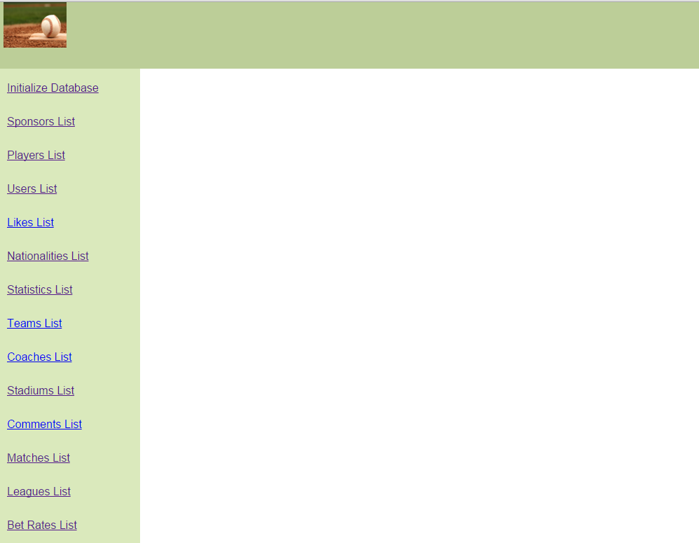

User Guide
==========

User guide explains how the project can be used. The features are explained for the user to navigate through the site easily.

.. toctree::

   member1
   member2
   member3
   member4
   member5

The Baseball Database project aims to allow baseball fans to connect with the sport they love. The site includes basic information about
the teams, players, leagues etc. that the followers of the sport identify with. They can be a part of something they love. Users are
allowed to contribute to the site by adding, updating and deleting information to/from the database.

Main Page

The main page has a user-friendly, simple design. It has the links which users use to navigate through the site. The links are included
in the default layout, so they are visible not only from the main page, but from each and every page.

