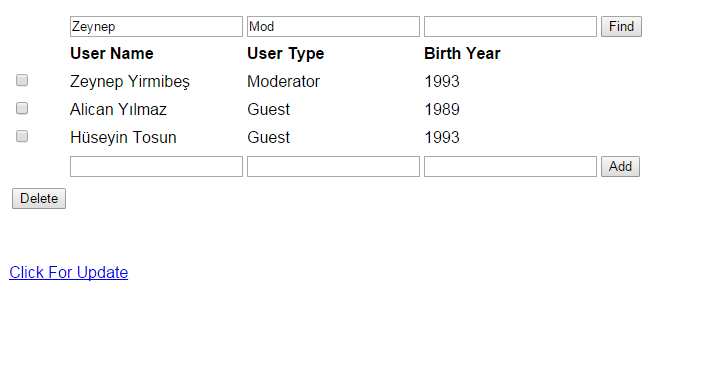

Parts Implemented by Hüseyin Tosun
==================================

The pages created by Hüseyin Tosun are the users, comments, likes pages.

Users Page
----------

This page contains information about the user name, user type, and birth year. The user is allowed to add, delete and update the information about
these users. The user can also search users using one or more of the attributes.

Comments Page
-------------

This page contains information about the comments that the users entered.  This page grabs information
from the players page. The user is allowed to add, delete and update a comment. The user can also
search comments using one or more of the attributes.

Likes Page
----------

This page contains likes and dislikes which are entered by users. It allows the users to add likes or dislikes
to players. This page grabs information from the users page, as well as the players page.
A chosen user is allowed to add, update and delete their like and dislikes to a chosen player.
The user can also search for entries using one or more of the attributes.

Operations

Sample Add Operation

Add operation is explained in the screenshots provided below.

Step One

.. figure:: usersPageAdd1.PNG
      :scale: 50 %
      :align: left
      :alt: screenshot of players page

Step Two

Sample Delete Operation

Delete operation is explained in the screenshots provided below.

Step One

Step Two

Sample Search Operation

Search operation is explained in the screenshots provided below.

Step One

Step Two

Sample Update Operation

Update operation is explained in the screenshots provided below.

Step One

Step Two

Step Three

