Parts Implemented by Burak Bayboğa
==================================

The pages created by Burak Bayboğa are the stadiums, matches and bet rates pages.

Stadiums Page

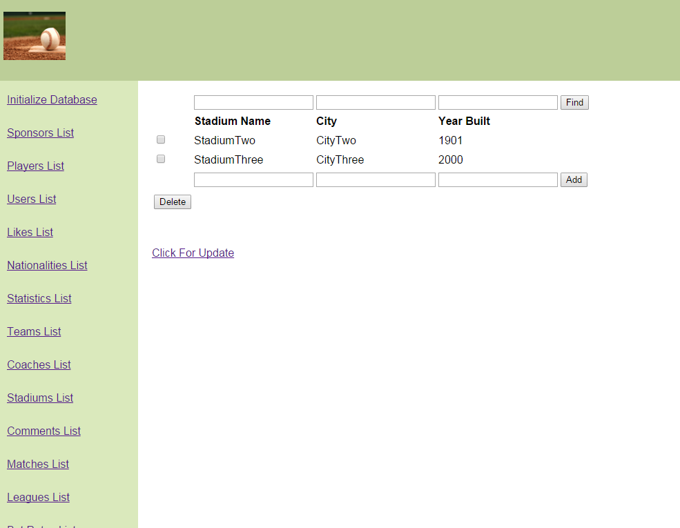

This page contains information about the stadiums, the year they were built in and the city they're in. The user is allowed to add, delete and update the information about
the stadiums. The user can also search stadiums using one or more of the attributes.

Matches Page

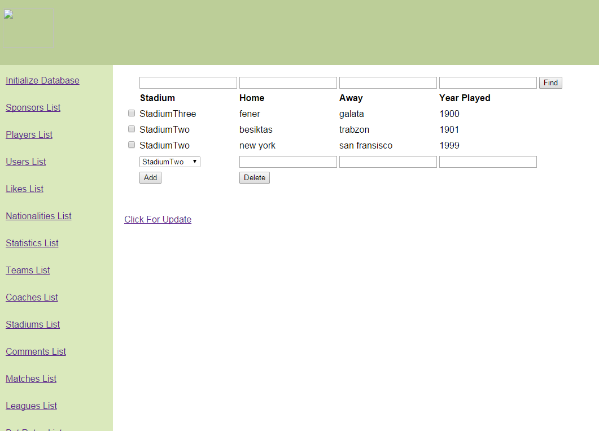

This page contains information about the matches between teams. This page grabs information
from the stadiums page. The user is allowed to add, delete and update the details of a match. The user can also
search matches using one or more of the attributes.

Bet Rates Page

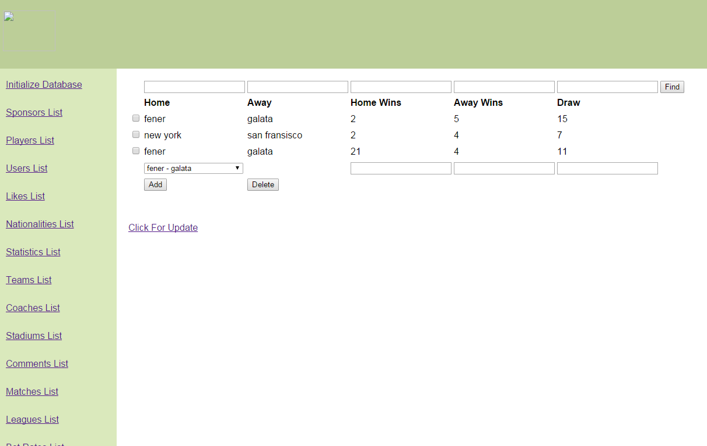

This page contains the bet rates of matches. This page grabs
information from the matches page and assigns the bet rates to them. The user is allowed to add, update and delete bet rates of matches.
The user can also search for entries using one or more of the attributes.

Operations

Sample Add Operation

Add operation is explained in the screenshots provided below.

Step One

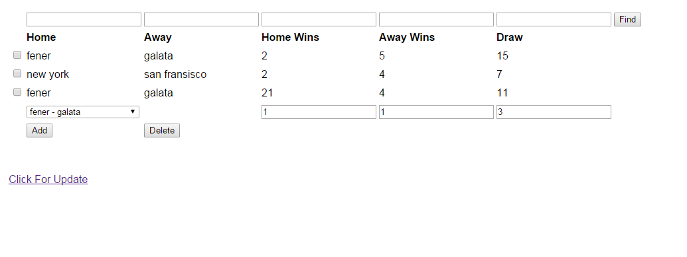

Step Two

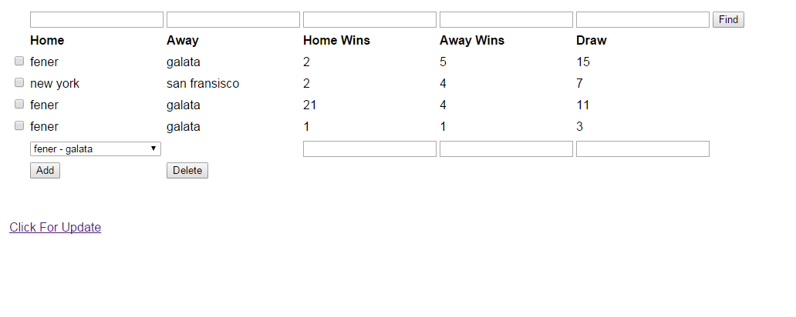

Sample Delete Operation

Delete operation is explained in the screenshots provided below.

Step One

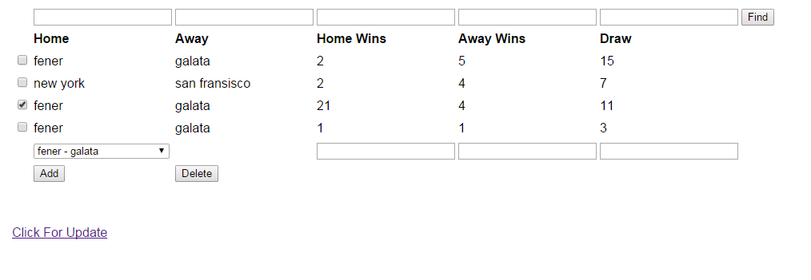

Step Two

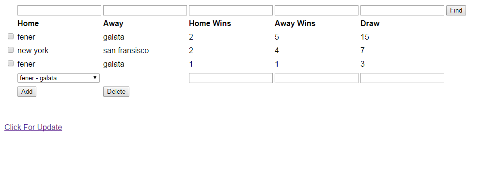

Sample Search Operation

Search operation is explained in the screenshots provided below.

Step One

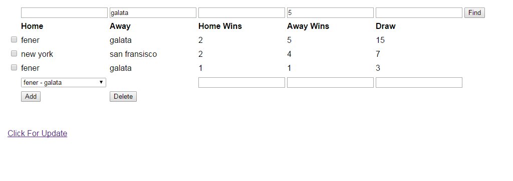

Step Two

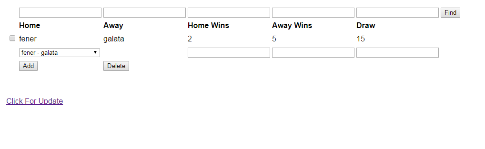

Sample Update Operation

Update operation is explained in the screenshots provided below.

Step One

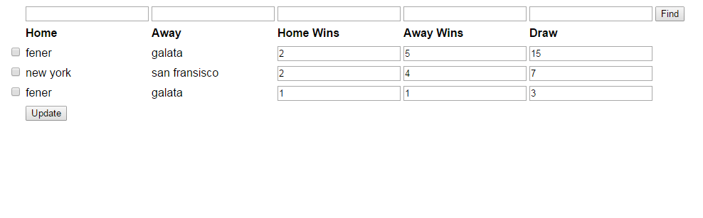

Step Two

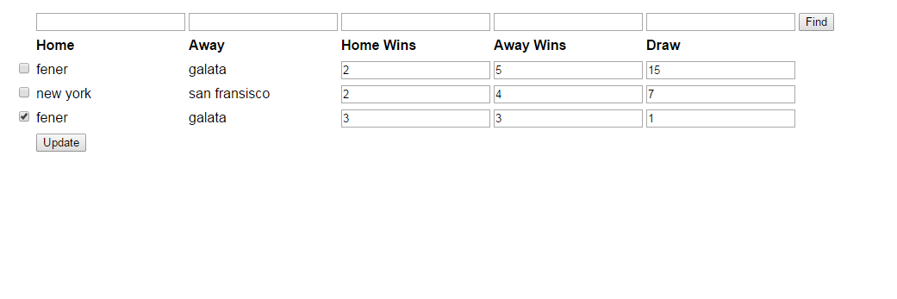

Step Three

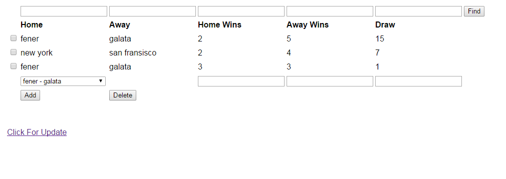

