Parts Implemented by Hüseyin Yavuz
==================================

The pages created by Hüseyin Yavuz are the teams, coaches and leagues pages.

Teams Page

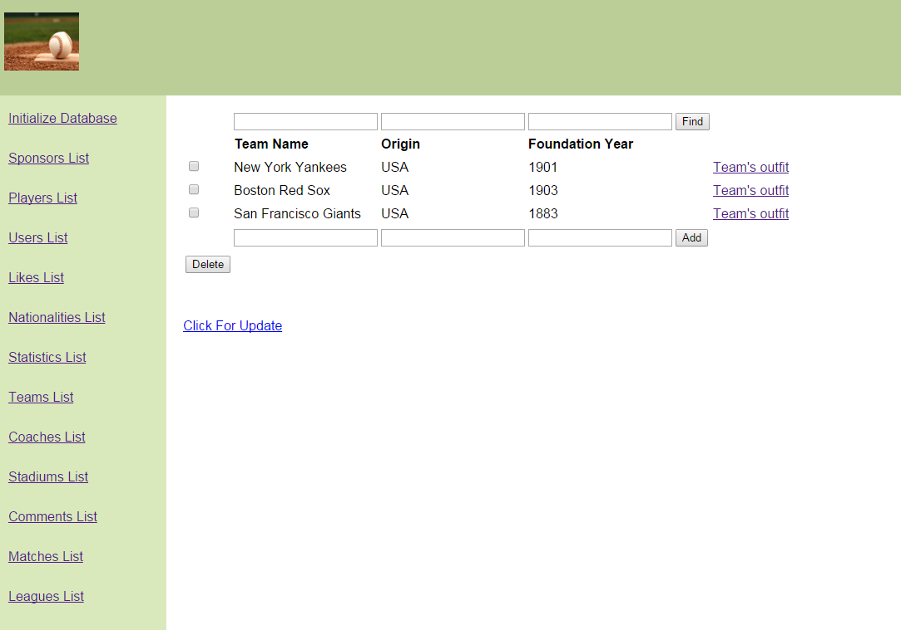

This page contains information about the teams, the country where they play and their foundation year.
It also has links for each team that
directs users to the outfit of that respective team.
The user is allowed to add, delete and update the information about these teams.
The user can also search teams using one or more of the attributes.

Coaches Page

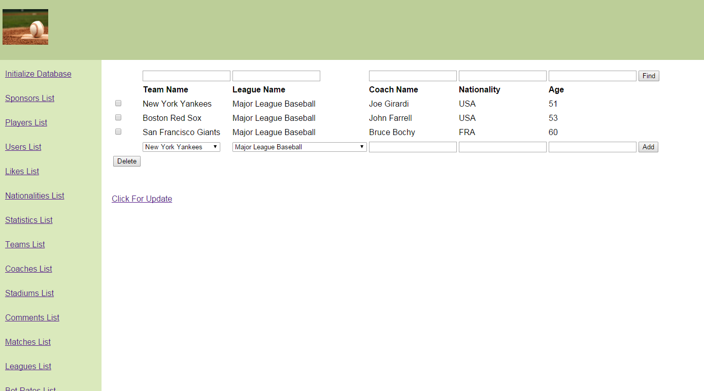

This page contains information about the coaches of teams.
It includes team name, league name, coach name, nationality and age.
This page grabs information from the teams page and leagues page.
Before entering the information about coaches, user must select the team and the league of that team.
The user is allowed to add, delete and update the information about coaches of a chosen team and league.
The user can also search coaches using one or more of the attributes.

Leagues Page

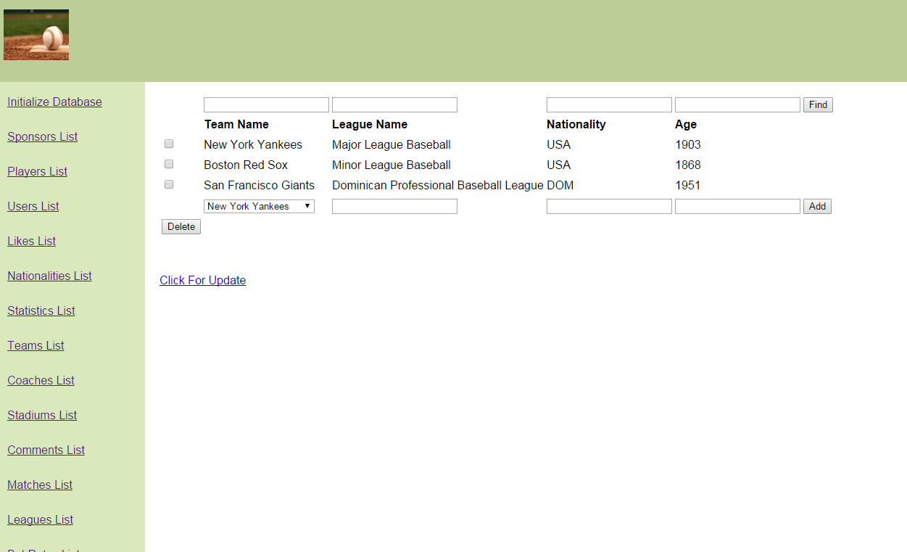

This page contains the information about leagues of respective team.
It includes the team name, league name, origin and foundation year.
This page grabs information about the teams. 
The user can add information about leagues of respective team.
The user is allowed to add, update and delete the information about leagues.
The user can also search for entries using one or more of the attributes.

Operations

Sample Add Operation

Add operation is explained in the screenshots provided below.

Step One

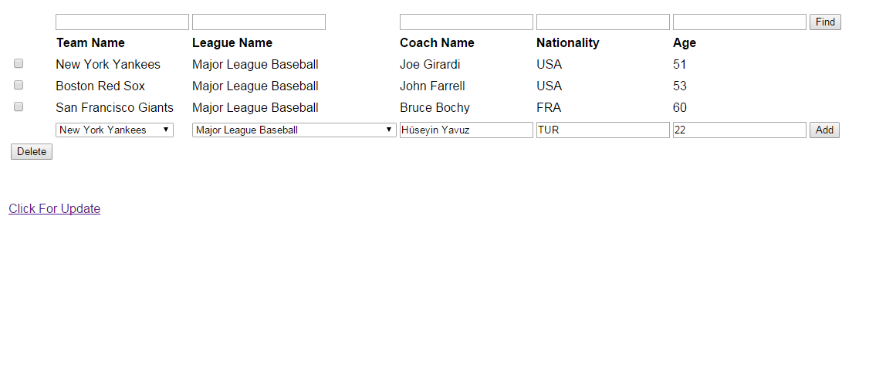

Step Two

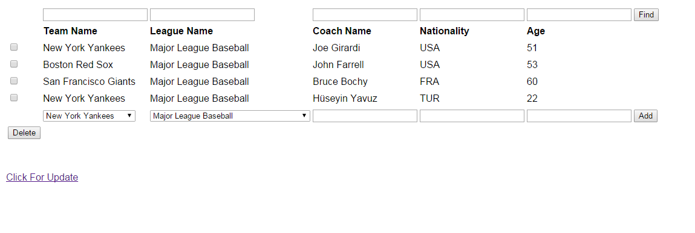

Sample Delete Operation

Delete operation is explained in the screenshots provided below.

Step One

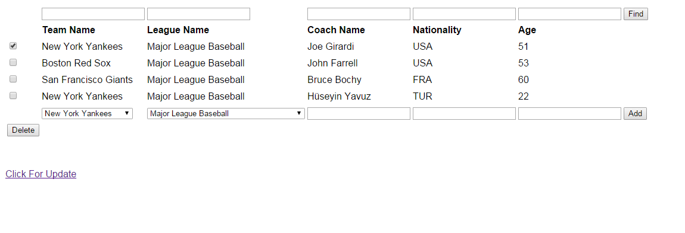

Step Two

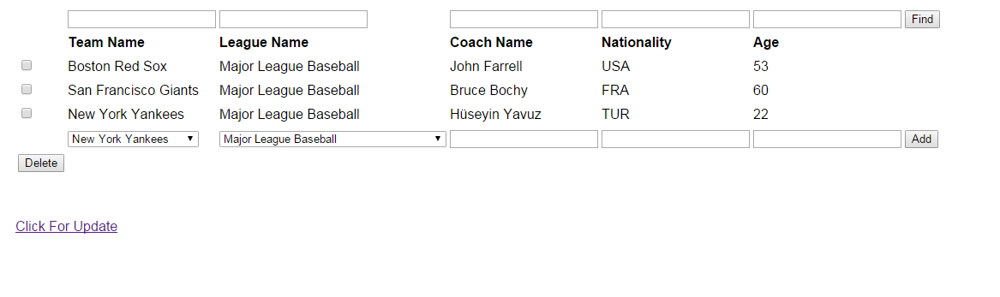

Sample Search Operation

Search operation is explained in the screenshots provided below.

Step One

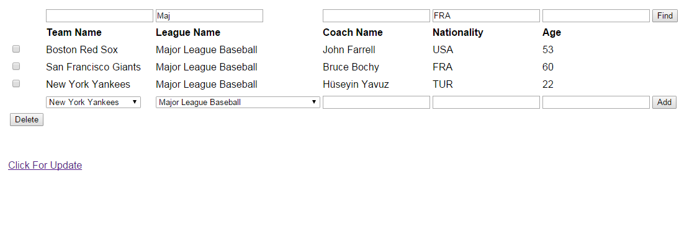

Step Two

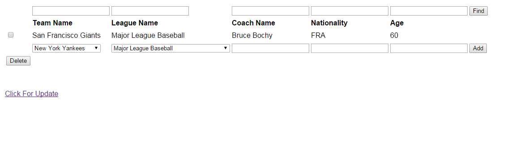

Sample Update Operation

Update operation is explained in the screenshots provided below.

Step One

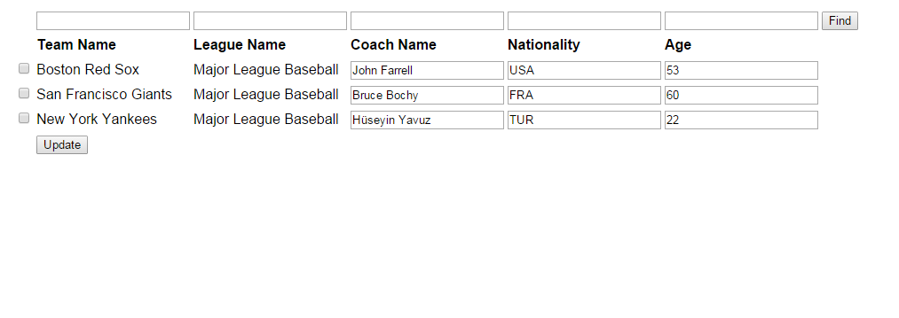

Step Two

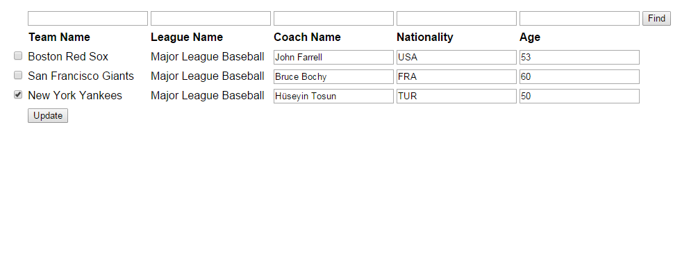

Step Three

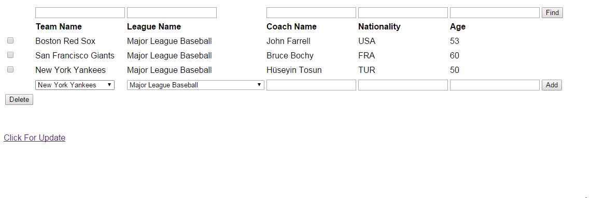

