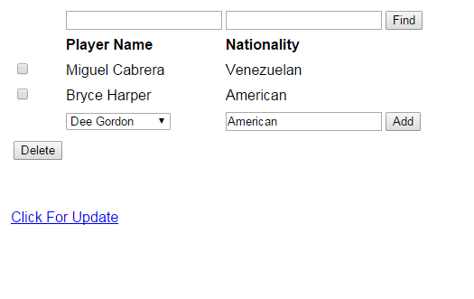
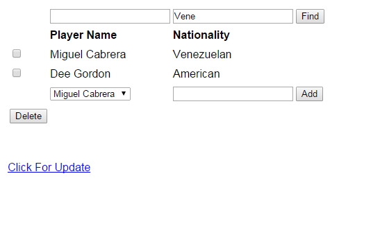
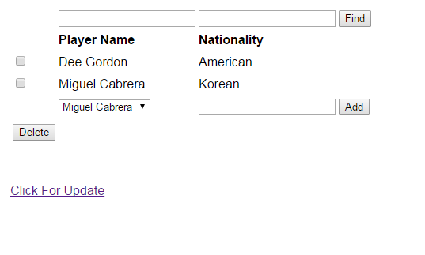

Parts Implemented by Zeynep Yirmibeşoğlu
========================================

The pages created by Zeynep Yirmibeşoğlu are the players, nationalities and statistics pages.

Players Page

This page contains information about the players, the country which they play and their age. It also has links for each player that
directs users to the team history of that respective player. The user is allowed to add, delete and update the information about
these players. The user can also search players using one or more of the attributes.

Nationalities Page

This page contains information about the nationalities of players. The difference between the country attribute in players page and
this page is the fact that a player can have a different nationality than the country he/she plays in. This page grabs information
from the players page. The user is allowed to add, delete and update the nationality of a chosen player. The user can also
search nationalities using one or more of the attributes.

Statistics Page

This page contains the statistics of players. It includes the number of games a player has played that season. This page grabs
information about the teams. The user is allowed to add, update and delete players and the number of games to a chosen team.
The user can also search for entries using one or more of the attributes.

Operations

Sample Add Operation

Add operation is explained in the screenshots provided below.

      Step One

.. figure:: natsPageAdd2.PNG
      :scale: 50 %
      :alt: screenshot of players page

      Step Two

Sample Delete Operation

Delete operation is explained in the screenshots provided below.

.. figure:: natsPageDelete1.PNG
      :scale: 50 %
      :alt: screenshot of players page

      Step One

.. figure:: natsPageDelete2.PNG
      :scale: 50 %
      :alt: screenshot of players page

      Step Two

Sample Search Operation

Search operation is explained in the screenshots provided below.

      Step One

.. figure:: natsPageFind2.PNG
      :scale: 50 %
      :alt: screenshot of players page

      Step Two

Sample Update Operation

Update operation is explained in the screenshots provided below.

.. figure:: natsPageUpdate1.PNG
      :scale: 50 %
      :alt: screenshot of players page

      Step One

.. figure:: natsPageUpdate2.PNG
      :scale: 50 %
      :alt: screenshot of players page

      Step Two

      Step Three
