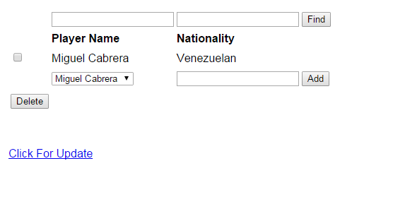

Parts Implemented by Gökay Şimşek
=================================
The pages created by Gökay Şimşek are the Players Team History, Sponsors and outfits pages.

Players Team History Page

.. figure:: playerTeamHistoryPage.PNG
      :scale: 50 %
      :alt: screenshot of playerTeamHistoryPage page

This page contains information about the players, team , starting time to play in team, ending time to play.

Sponsors Page

.. figure:: sponsorPage.PNG
      :scale: 50 %
      :alt: screenshot of players page

This page contains information about the sponsors of teams.

outfits Page

.. figure:: OutFitsPage.PNG
      :scale: 50 %
      :alt: screenshot of players page

This page contains the outfis of teams.

Operations

Sample Add Operation

Add operation is explained in the screenshots provided below.

.. figure:: natsPageAdd1.PNG
      :scale: 50 %
      :alt: screenshot of players page

      Step One

      Step Two

Sample Delete Operation

Delete operation is explained in the screenshots provided below.

      Step One

      Step Two

Sample Search Operation

Search operation is explained in the screenshots provided below.

.. figure:: natsPageFind1.PNG
      :scale: 50 %
      :alt: screenshot of players page

      Step One

      Step Two

Sample Update Operation

Update operation is explained in the screenshots provided below.

      Step One

      Step Two

.. figure:: natsPageUpdate3.PNG
      :scale: 50 %
      :alt: screenshot of players page

      Step Three